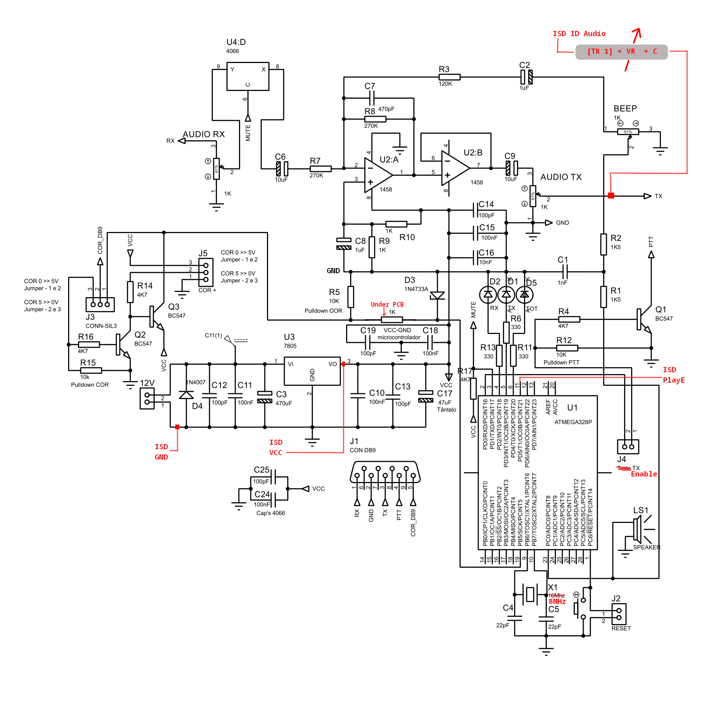
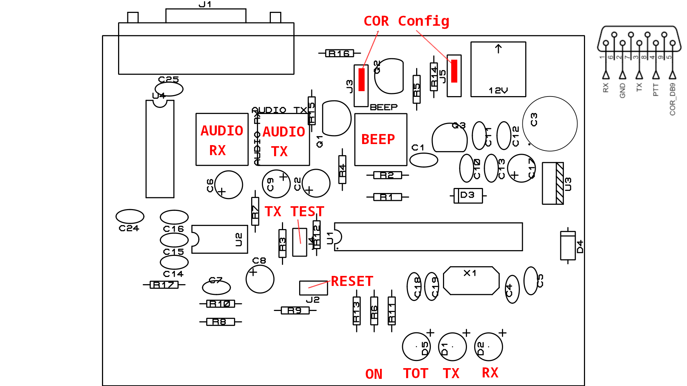

# avr-ham-repeater

This project evolves from an already existing hardware built by CT1BMU and his
son, based on what is supposed to be an original by a Brazilian fellow ham but
no references to he original author were found. 

The need to change what was already done comes from the feature that we have
already integrated in a couple of repeaters - **inhibit the voice announcement ID
while the repeater is being used**.

There was a problem though, no information existed regarding software and hardware.

Meanwhile, after some time, Emanuel CT1BDV was able to supply what was the original
schematic without the post modifications/adaptations made by CT1BMU.

With the schematic and controller in our hands we were able to map those modifications
and have a base schematic to work on for the software/firmware  which was lacking.

The controller connects two radios (2x Motorola GM350) and needs to provide all
the basic functionalities:

- Repeat signals present at the receiving end
- Implement TOT (Time out Timer)
- Implement the repeater ID with inhibition while in use
- Reuse the morse/beeping circuitry

The software was written from scratch in bare metal C code for the ATMEGA328P.
It uses all the three timers and a few IO pins:

|Pin|Ref|Description
|---|---|--------
|2  |PD0|TX PTT control
|3  |PD1|RX Audio mute/unmute control
|4  |PD2|RX Led
|5  |PD3|TX Led
|6  |PD4|TOT Led
|11 |PD5|External ISD board play control
|19 |PB5|Receiver COS/COR/CAS signal
|23 |PC0|Morse/Beep digital output

## Hardware

### Schematic



### Layout



## Firmware

The C code has comments that better explain the implementation and most parameters
are exposed as definitions that can be edited and then recompiled.

### Implementation

The new firmware implements the following:

- TOT Time out timer (3 min.)
- on TOT enter, beep burst with rx audio mute
- TOT penalty of 1.5 sec. No RX can happen, in the mentioned time, to disable TOT
- while in time out, transmit "TOT" in Morse, every 5 sec.
- on TOT leave, transmit "K" in morse
- Voice ID every 10 minutes (ISD)
- when reaching ID time, the last 6 sec must be without any rx (ID wait)
- every hour, after the voice ID, the callsign is also sent in morse
- 1 second tail with 1.25 kHz 40 ms beep indicating TOT timer reset. A morse T
- On ID wait, evaluating the last 6 seconds before ID, the tail will resemble a morse I

### Build the firmware

Below in this document, there's a couple tips on how to setup the toolchain.

To build the firmware you can use `make`. To flash use `make flash` followed by 
`make fuse` to "burn the fuses".

We've used the programmer XGecu TL866 II Plus (TL866II+) with minipro linux software.

## Special thanks

As always, thanks to the ARM team in particular, by callsign order:

- CT1BDV Emanuel
- CT1EUK Freitas
- CT1EYN Costa
- CS7AFE Carlos
- CS7ALF Constantino
- CR7AQJ Soares

and to the testers:

- CT1ENP Ribeiro
- CT1EUK Freitas
- CT1EYN Costa


## Development tips

### Install toolchain

```
>$ sudo apt-get install gcc-avr binutils-avr avr-libc
>$ sudo apt-get install avrdude
```

and avr-gcc

```
Install package 'avr-gcc' to provide command 'avr-gcc'? [N/y] y


 * Waiting in queue... 
The following packages have to be installed:
 avr-gcc-1:11.2.0-1.fc36.x86_64	Cross Compiling GNU GCC targeted at avr
Proceed with changes? [N/y] y
```

### Compile

```
$ avr-gcc -Os -DF_CPU=16000000UL -mmcu=atmega328p -c -o blink_led.o blink_led.c
```

We create the executable:

```
$ avr-gcc -mmcu=atmega328p blink_led.o -o blink_led
```
And we convert the executable to a binary file:

```
$ avr-objcopy -O ihex -R .eeprom blink_led blink_led.hex
```
Finally, we can upload the binary file:

```
$ avrdude -F -V -c arduino -p ATMEGA328P -P /dev/ttyACM0 -b 115200 -U flash:w:blink_led.hex
```
Look at your Arduino Uno! The led is blinking!


### Weird things

After upgrading to Fedora 37 the infoic.xml error appeared.
Workaround is to copy the file to the location of project where you run minipro to flash.
That's why you see the file in this folder, with the code. Don't need to include in git.
In Fedora 37, it's residing originally in /usr/share/minipro/

## Links

- https://create.arduino.cc/projecthub/milanistef/introduction-to-bare-metal-programming-in-arduino-uno-f3e2b4
